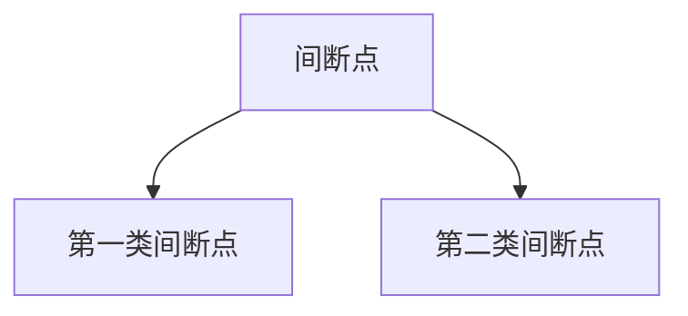
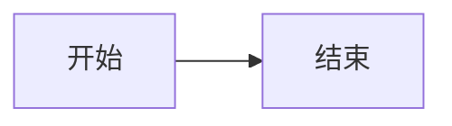
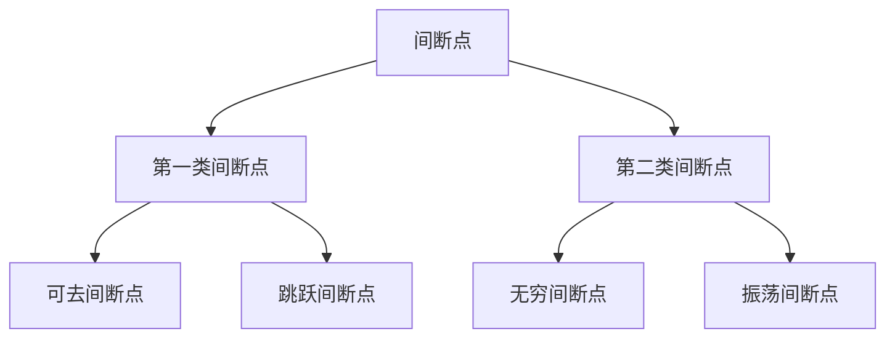

# Mermaid 图表（```mermaid）

## Status

- Author-facing: yes（通过代码围栏，不是直接调用组件）
- Source: `nuxt.config.ts` → `remark-code-component` 的 `mermaid: { component: 'mermaid', prop: 'code' }`；组件 `app/components/content/Mermaid.vue`
- Source verified: yes
- Usage verified: yes（`content/previews/example.md`）

## Purpose

用 Mermaid 语法画流程图、时序图等。**作者只需要写代码围栏**，`remark-code-component` 会把围栏替换成 `Mermaid` 组件并把代码传给它的 `code` prop。

## Syntax

````md

````

## How it works

```text
mermaid 代码围栏
  → remark-code-component：lang = 'mermaid'
  → <Mermaid code="…" />
  → Mermaid.vue：进入视口附近才动态 import('mermaid')，用主题色渲染 SVG
```

- 组件 props（若确实要直接调用）：`code: string`（必填）。
- 主题跟随亮/暗色模式重绘（`useColorMode`）；`startOnLoad: false`，不会扫描页面其它元素。
- 渲染失败时展示可折叠的错误详情，并回退为 `language="mermaid"` 的代码块。
- 超宽图表默认横向滚动，悬停/聚焦弹出「适应宽度 / 横向滚动」切换按钮。

## Special syntax

- 围栏**必须是 `mermaid`**，大小写与其它 meta 都不支持（`components[node.lang]` 精确匹配）。
- 不要在围栏上加 `wrap` / `expand` / 文件名等 meta —— 该映射只取 `node.value`，meta 会被丢弃。
- 直接写 `::mermaid{code="…"}` 也能渲染，但多行代码在属性里很难写，不推荐。

## Minimal example

````md

````

## Complete example

````md

````

## Common mistakes

1. 语言写成 `Mermaid` / `mmd` —— 映射表里只有 `mermaid`（`mmd` 只影响代码块图标，不做转换）。
2. 在图表里用 HTML 标签 —— Mermaid 的 `securityLevel` 默认会过滤，且文本落在 `foreignObject` 中会继承文章样式。
3. 以为图表会在展开前就渲染好：隐藏容器（如未激活的 Tab、折叠面板）内会用 0 尺寸量取而错位。
4. 图表语法错误 → 页面显示「图表渲染失败」，先看错误详情再改语法。

## Related references

- `music-score.md`、`shiki-notation.md`、`prose-pre.md`
